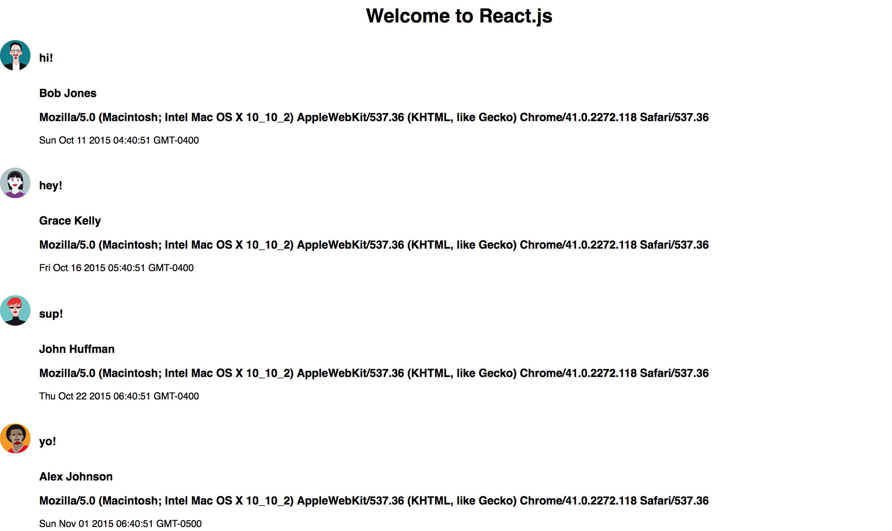

#### Take-Home Code Challenge

I created a simple single page react.js app that pulls information from this endpoint  http://private-227b9-jsonapifizzbuzz.apiary-mock.com/messages.
I created this application using create-react-app. I used axios to make the api calls and moment.js in order to format the dates correctly.



## Getting Started/Running Locally

1. Install npm
```shell
  npm install
```
2. Running the server (should open http://localhost:3000/ in your browser automatically)
```
npm start
```

## Technology

The application is currently using the following technologies:
* Languages: HTML, CSS, JavaScript
* Frameworks/Libraries: React.js, Axios, Moment.js

## Author
* [Anthony Ciccone](https://github.com/anticcone/)
